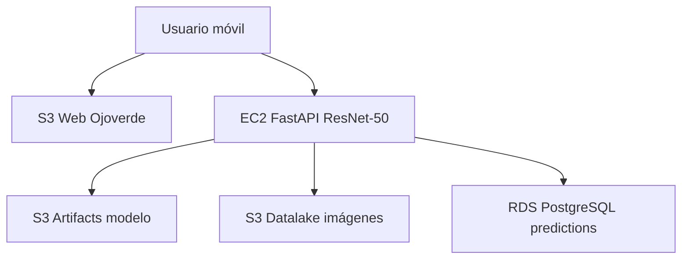

# Plant Disease Detector — AWS + ResNet-50 (Ojoverde)

Proyecto **paralelo** al [plant-disease-detector](https://github.com/danielrpo1/plant-disease-detector) (EfficientNet-B0 + ONNX en GitHub Pages).

| Repo | Modelo | Inferencia | Persistencia |
|------|--------|------------|--------------|
| `plant-disease-detector` | EfficientNet-B0 | Navegador (ONNX) | No |
| **`plant-disease-detector-aws`** (este) | **ResNet-50** (timm) | **EC2 FastAPI** | **S3** + **RDS PostgreSQL** |

## Arquitectura AWS



Documentación completa con diagramas de flujo: [`docs/ARQUITECTURA_AWS.md`](docs/ARQUITECTURA_AWS.md)

## URLs desplegadas

| Servicio | URL |
|----------|-----|
| **Repositorio** | https://github.com/danielrpo1/plant-disease-detector-aws |
| **App Ojoverde (recomendada)** | **http://18.188.204.143/** |
| **Swagger** | http://18.188.204.143/docs |
| **Admin** | http://18.188.204.143/admin/ |
| Web estática S3 (opcional) | http://plant-web-darestrepo-eafit.s3-website-us-east-1.amazonaws.com |

## Estado del despliegue

| Fase | Estado |
|------|--------|
| RDS PostgreSQL + tabla `predictions` | ✓ |
| S3 buckets (web, artifacts, datalake) | ✓ |
| Modelo en S3 | ✓ (bootstrap; reemplazar con checkpoint entrenado) |
| EC2 + API | ✓ |
| Frontend S3 | ✓ (si el bucket no es público, activa política en consola S3) |

## Inicio rápido

```bash
cp .env.example .env   # credenciales AWS + DATABASE_URL
python scripts/init_rds.py
./infra/deploy_ec2_api.sh
./infra/deploy_web_s3.sh
```

## Estructura

```
plant-disease-detector-aws/
├── api/              # FastAPI (EC2)
├── webapp/           # Ojoverde frontend (S3)
├── src/              # ResNet-50, export, inferencia
├── infra/            # deploy EC2, S3, SQL
├── docs/             # arquitectura AWS
└── scripts/          # init RDS, bootstrap artifacts
```

## Equipo

Proyecto integrador EAFIT — mismo equipo que [plant-disease-detector](https://github.com/danielrpo1/plant-disease-detector).

| Integrante | GitHub |
|------------|--------|
| Daniel Restrepo | [@danielrpo1](https://github.com/danielrpo1) |
| Obeney Londoño | [@Obeney](https://github.com/Obeney) |
| E-DOR28 | [@E-DOR28](https://github.com/E-DOR28) |
| Eider Díaz | [@EiderDiaz-10](https://github.com/EiderDiaz-10) |
| Valentina Delgado | [@ValenDelgado](https://github.com/ValenDelgado) |

## Free tier

[`infra/FREE_TIER.md`](infra/FREE_TIER.md) · [`docs/QUE_NECESITO_DE_TI.md`](docs/QUE_NECESITO_DE_TI.md)
