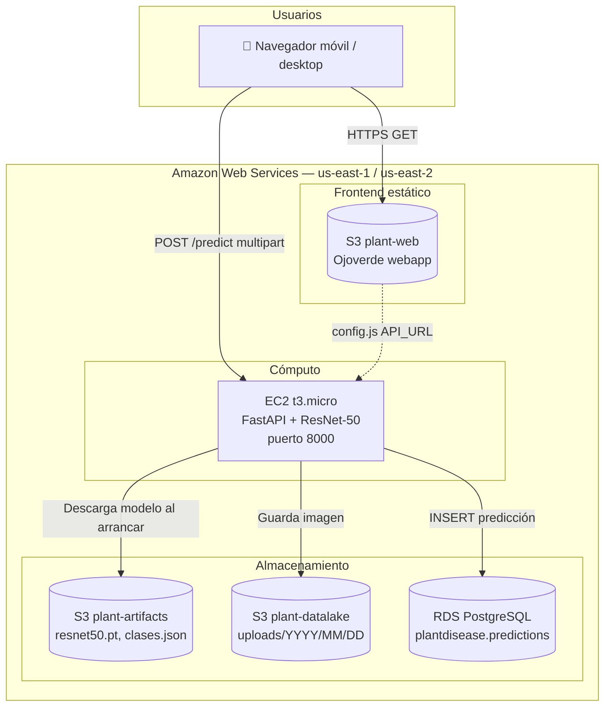
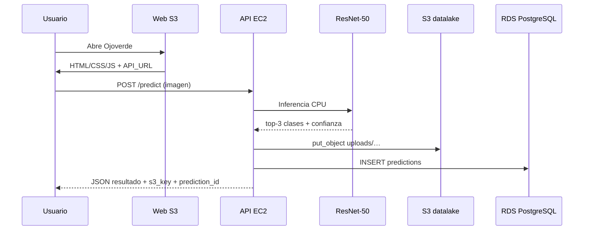
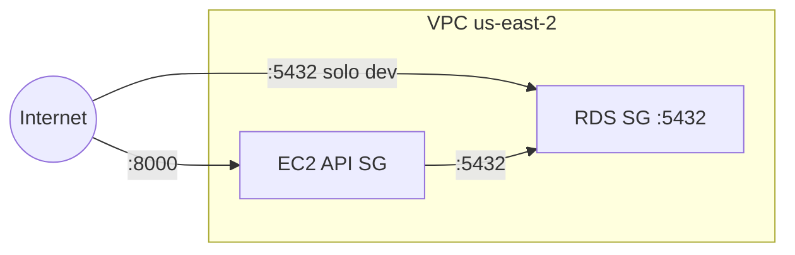

# Arquitectura AWS — Ojoverde (Plant Disease Detector)

Proyecto integrador EAFIT: clasificación de enfermedades en hojas con **ResNet-50**, desplegado en AWS.

## Diagrama de arquitectura



## Flujo de una predicción



## Componentes

| Servicio | Recurso | Región | Rol |
|----------|---------|--------|-----|
| **S3 web** | `plant-web-darestrepo-eafit` | us-east-1 | Frontend Ojoverde (HTML/JS/CSS) |
| **S3 artifacts** | `plant-artifacts-darestrepo-eafit` | us-east-1 | Modelo `resnet50.pt` y JSON de clases |
| **S3 datalake** | `plant-datalake-darestrepo-eafit` | us-east-1 | Imágenes subidas por usuarios |
| **RDS** | `plant-disease-db-darestrepo-eafit` | us-east-2 | Historial en tabla `predictions` |
| **EC2** | `plant-disease-api` (t3.micro) | us-east-2 | API FastAPI + inferencia |

## Red y seguridad



- La API EC2 y RDS comparten VPC; el grupo de seguridad de RDS permite PostgreSQL desde el SG de la API.
- RDS puede estar en modo privado en producción; la API accede por red interna.
- Las claves IAM del despliegue **no** van al repositorio (`.env` en `.gitignore`).

## Repos relacionados

| Repo | URL | Rol |
|------|-----|-----|
| Demo ONNX (GitHub Pages) | [plant-disease-detector](https://github.com/danielrpo1/plant-disease-detector) | EfficientNet-B0 en navegador |
| **AWS (este)** | [plant-disease-detector-aws](https://github.com/danielrpo1/plant-disease-detector-aws) | ResNet-50 + S3 + RDS + EC2 |

## Scripts de despliegue

```bash
./infra/deploy_ec2_api.sh   # EC2 + systemd + health check
./infra/deploy_web_s3.sh    # webapp → S3 + config.js con API_URL
python scripts/init_rds.py   # tabla predictions (desde Mac si RDS público)
```

## Coste estimado (free tier)

- EC2 t3.micro: 750 h/mes gratis (12 meses)
- RDS db.t3.micro: 750 h/mes gratis (12 meses)
- S3: pocos GB → centavos
- **Budget alert recomendado:** 5 USD/mes
